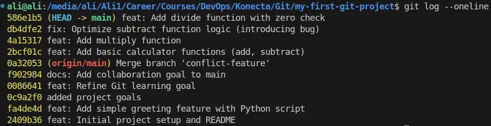
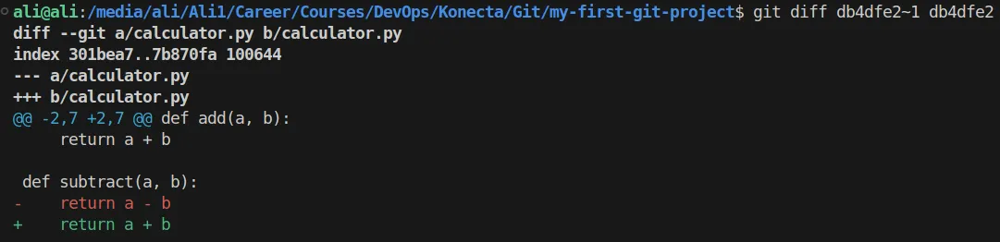
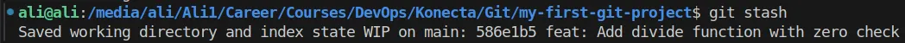
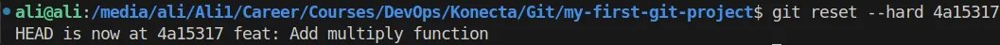
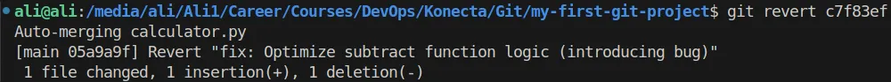
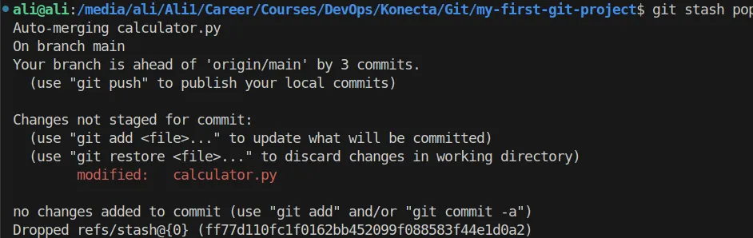
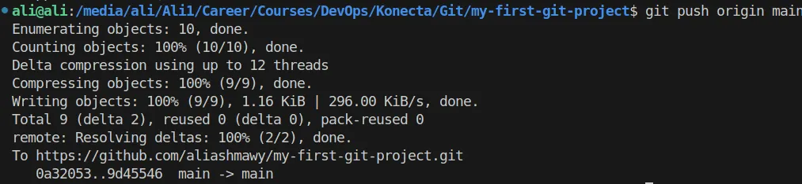

## 1. List Of all Git Command I used

- `git add`
- `git commit`
- `git log --oneline`
- `git status`
- `git stash`
- `git reset --hard`
- `git revert`
- `git stash pop`
- `git push origin main`

---

## 2. Screenshots for Important commands

### `git log`



---

### `git diff`



---

### `git stash`



---

### `git reset`



---

### `git revert`



---

### `git stash pop`



---

### `git push`



---

## 3. `calculator.py`

```python
def add(a, b):
    return a + b

def subtract(a, b):
    return a - b

def multiply(a, b):
    return a * b

# Add this new function
def divide(a, b):
    if b == 0:
        return "Cannot divide by zero!"
    return a / b

print(f"Adding 5 and 3: {add(5, 3)}")
print(f"Subtracting 10 and 4: {subtract(10, 4)}")
print(f"Multiplying 6 and 7: {multiply(6, 7)}")
print(f"Dividing 20 by 5: {divide(20, 5)}")
# Some new experimental print statement
print("Experimental feature: Fibonacci sequence next")
```

---

## 4. Written Explanation

### How `git log` and `git diff` helped identify the erroneous commit

- `git log --oneline` was used to list all the commits you made in that branch, So it helped to identify the commit hash of the commit when the bug was introduced
- `git diff` was used to show changes between commits. So we used to compare the target commit with its previous one (`~1`) to detect the bug

---

## Why `git stash` is useful in that scenario

- `git stash` is used to temporarily save changes that are not yet ready to be staged or commited
- So in our scenario we just discovered a bug in a previous commit and it’s not right to make new commits until we solve the bug first
- So instead of deleting the change and lose our progress, we use `git stash` to save it until we solve the bug from the previous commit.

---

## Explain your choice

- I Chose `git reset --hard` because the commits are not pushed yet and the local repository is not used by more than 1 user
- Also the changes that are deleted are not significant so i can do it manually.
- The History will be cleaner.

### `git reset --hard`

### Pros:

- Makes History more clean
- Reset is more suitable for local changes

### Cons:

- It rewrites the commit history by undoing the operations
- Not safe if the branch is shared, so developers can lose their work and have conflicts
- You lose changes permanently

### `git revert`

### Pros:

- preserve commit history by creating a new commit that undoes the change
- The safer option if the branch is shareable

### Cons:

- History gets longer because revert adds a new commit.
- If you do a lot of reverts, history will become noisy and complex to deal with

---

## `git stash pop` Vs `git stash apply`

### `git stash pop`

- Apply and remove the most recent stash
- Can behave like `git stash apply` if there are conflicts, So it becomes risky because users might accidentally popping the same stash because they thought it was dropped automatically

### `git stash apply`

- Apply the most recent stash but still keeps it in the stash list
- You can later drop it using `git stash drop`

---
